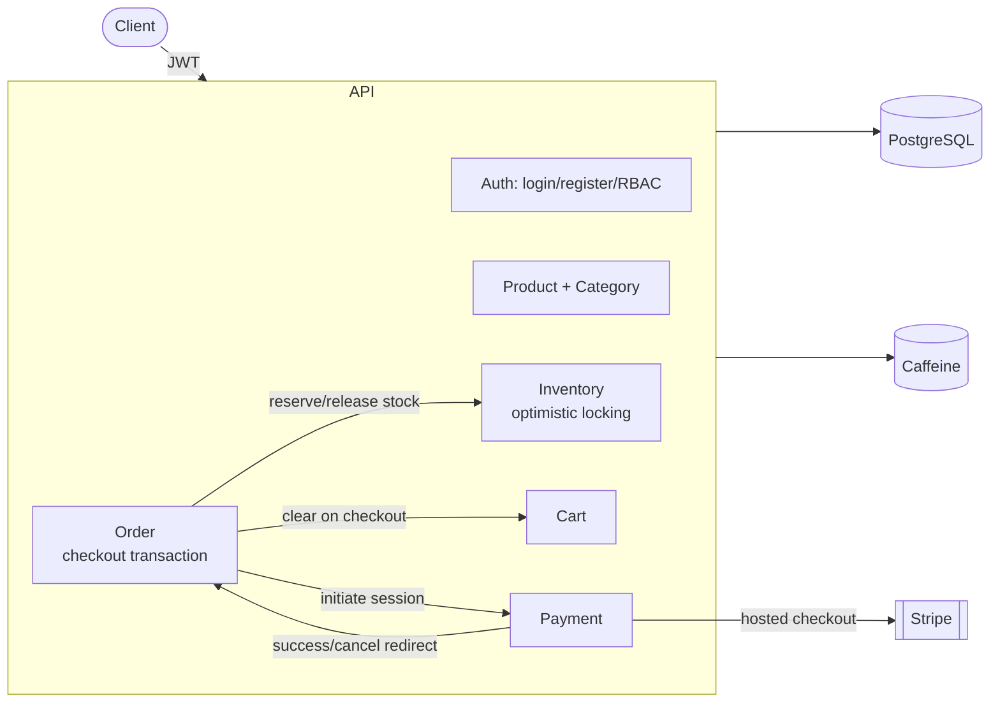

# Ecommerce Backend


A production-style **Spring Boot REST API** for an ecommerce platform, built around a modular, domain-driven monolith. It covers the full customer journey — catalog browsing, cart, checkout, inventory reservation, and Stripe payments — plus an RBAC-secured admin surface, JWT authentication, in-memory caching, and Flyway-managed PostgreSQL schemas.

This project was built as part of the **Ostad Java Course** to practice production-grade backend patterns: layered service architecture, optimistic locking, transactional checkout, RBAC authorization, and API documentation.

## Table of Contents

- [Features](#features)
- [Tech Stack](#tech-stack)
- [Architecture](#architecture)
- [API Overview](#api-overview)
- [Getting Started](#getting-started)
- [Configuration](#configuration)
- [Running Tests](#running-tests)
- [Building](#building)
- [Using the Postman Collection](#using-the-postman-collection)
- [Troubleshooting](#troubleshooting)
- [Contributing](#contributing)
- [License](#license)

## Features

**Authentication & Authorization**
- Stateless JWT authentication with short-lived access tokens and rotating refresh tokens
- Fine-grained RBAC: roles (`ADMIN`, `CUSTOMER`, `PRODUCT_MANAGER`, `INVENTORY_MANAGER`, `SUPPORT_AGENT`) composed from granular permissions, enforced via method-level security
- Ownership checks on cart/order access (a customer can only act on their own resources)

**Catalog & Inventory**
- Category and product management with pagination
- Per-product inventory tracking with **optimistic locking** (`@Version`) to prevent lost updates under concurrent stock changes
- Admin operations to increase, decrease, reserve, and release stock independently of checkout

**Cart & Checkout**
- Per-user shopping cart with active-product and available-stock validation on add
- Single-transaction checkout: validates the cart, reserves inventory, snapshots line items onto an immutable order, clears the cart, and kicks off payment — all atomically
- Order lifecycle: `CREATED → CONFIRMED → PAID → CANCELLED`, with cancellation releasing reserved inventory

**Payments**
- Stripe Checkout Session integration for hosted payment pages
- Success/failure redirect handlers that transition payment and order state
- Scheduled job that automatically expires unpaid confirmed orders after a configurable timeout, releasing their reserved inventory

> **Note:** JWT access-token revocation on logout is tracked in an in-memory (per-instance) cache. If this app is ever horizontally scaled to multiple instances, a token revoked on one instance won't be recognized by the others — revisit with a shared store at that point.

**Platform**
- Consistent `ApiResponse<T>` envelope for every success response and RFC 7807 `ProblemDetail` for every error
- In-memory (Caffeine) caching for product/category reads with per-cache TTLs
- Centralized, versioned API path (`/api/v1`) and OpenAPI/Swagger documentation
- Flyway-versioned PostgreSQL schema, containerized local Postgres dependency via Docker Compose

## Tech Stack

| Layer | Technology |
|---|---|
| Language / Runtime | Java 25 |
| Framework | Spring Boot 4.0.6 (Web MVC, Security, Data JPA, Cache, Validation) |
| Database | PostgreSQL 17.5 |
| Migrations | Flyway |
| Caching | Caffeine (in-memory) |
| Auth | JWT (`jjwt`), Spring Security, BCrypt |
| Payments | Stripe Java SDK |
| Mapping | MapStruct |
| Boilerplate reduction | Lombok |
| API Docs | springdoc-openapi / Swagger UI |
| Build tool | Gradle (wrapper included) |
| Testing | JUnit 5, Spring Boot Test, H2, AssertJ |

## Architecture

The application is a **modular monolith organized by business domain** rather than by technical layer. Each domain package (`auth`, `product`, `inventory`, `cart`, `order`, `payment`, `common`) is a self-contained vertical slice with its own controllers, DTOs, entities, mappers, repositories, and services.

```
com.example.ecommerce.backend
├── auth        User, Role, Permission, RefreshToken — JWT auth & RBAC
├── product     Category, Product — catalog management
├── inventory   Inventory — stock tracking with optimistic locking
├── cart        Cart, CartItem — per-user shopping cart
├── order       Order, OrderItem — checkout & order lifecycle
├── payment     PaymentHistory — Stripe integration & expiration scheduling
└── common      BaseEntity, ApiResponse, GlobalExceptionHandler, ApiEndpoints
```

**Checkout is the central cross-domain transaction.** Placing an order validates the cart, reserves inventory, snapshots cart items into immutable order line items, persists the order, clears the cart, and initiates a Stripe payment session — all within a single `@Transactional` boundary, so a failure at any step rolls back the whole operation.



## API Overview

All endpoints are versioned under **`/api/v1`**. Full request/response schemas are available via Swagger UI once the app is running (see [Getting Started](#getting-started)).

| Domain | Base path | Highlights |
|---|---|---|
| Authentication | `/api/v1/auth` | Register, login, refresh token, logout |
| Categories | `/api/v1/categories` | Public read access; paginated listing |
| Products | `/api/v1/products` | Public read access; paginated listing |
| Cart | `/api/v1/cart` | Add item, view current user's cart |
| Orders | `/api/v1/orders` | Checkout, cancel, view own orders |
| Payments | `/api/v1/payments` | Stripe success/failure redirect handlers |
| Inventory | `/api/v1/inventory` | Public stock lookup by product |
| Admin — Products | `/api/v1/admin/products` | Create, update, delete |
| Admin — Categories | `/api/v1/admin/categories` | Create, update, activate/deactivate, delete |
| Admin — Inventory | `/api/v1/admin/inventory` | Increase, decrease, reserve, release stock |
| Admin — Orders | `/api/v1/admin/orders` | View and cancel any order |
| Admin — Roles & Permissions | `/api/v1/admin/roles`, `/api/v1/admin/permissions` | Manage RBAC roles, permissions, and assignments |
| Admin — Users | `/api/v1/admin/users` | Assign/revoke roles on a user |

Admin routes require an authenticated user holding one of `ADMIN`, `PRODUCT_MANAGER`, `INVENTORY_MANAGER`, or `SUPPORT_AGENT`, further narrowed per-operation by fine-grained permissions (e.g. `PERMISSION_PRODUCT_CREATE`).

## Getting Started

### Prerequisites

- JDK 25
- Docker Desktop or Docker Engine with Docker Compose
- Postman (optional, for manual API testing)

The Gradle wrapper is included, so a separate Gradle installation is not required.

### 1. Start dependencies (PostgreSQL)

```bash
docker compose up -d
docker compose ps
```

| Service | Container | Host port |
|---|---|---|
| PostgreSQL 17.5 | `ecommerce_postgres` | `5432` |

Default database credentials: `ecommerce_db` / `admin` / `admin@123` (see `compose.yml`).

### 2. Run the application

```bash
./gradlew bootRun
```

```powershell
.\gradlew.bat bootRun
```

The app starts on `http://localhost:8080` with the `dev` profile active by default. Flyway applies all pending migrations automatically on startup.

### 3. Explore the API

- Swagger UI: `http://localhost:8080/swagger-ui/index.html`
- OpenAPI JSON: `http://localhost:8080/v3/api-docs`

## Configuration

Main configuration files:

- `src/main/resources/application.yaml` — profile-agnostic settings (JWT expiration, payment expiration timing)
- `src/main/resources/application-dev.yaml` — local datasource, Stripe, and logging config

Flyway migrations live in `src/main/resources/db/migration` and are applied automatically at startup.

Key configurable properties (`application.yaml`):

```yaml
payment:
  expiration:
    lifetime: 5m        # how long an unpaid order stays valid
    check-delay: 60s    # how often the expiration scheduler runs

jwt:
  expiration: 15m
  refresh-expiration: 7d
```

## Running Tests

```bash
./gradlew test
```

```powershell
.\gradlew.bat test
```

Tests run against an in-memory H2 database (`application-test.yml`, profile `test`) with a dedicated Flyway migration set under `src/test/resources/db/test-migration`. Caching is in-memory (Caffeine), so no external service is required for the Spring context to load.

Test coverage includes repository-layer tests (`@DataJpaTest`) and full-stack controller integration tests (`@SpringBootTest` + `MockMvc`) covering RBAC, validation, and error-mapping behavior.

## Building

```bash
./gradlew build
```

```powershell
.\gradlew.bat build
```

The build artifact is produced under `build/libs`.

## Using the Postman Collection

A ready-to-import Postman collection is included: [`Ecommerce Backend.postman_collection.json`](Ecommerce%20Backend.postman_collection.json).

1. Import the collection into Postman.
2. Confirm the collection variable `BASE_URL` is set to `http://localhost:8080`.
3. Start PostgreSQL and the application.
4. Run requests from the collection — it includes happy-path CRUD flows, duplicate/validation error scenarios, and category activation/deactivation examples.

## Troubleshooting

**Port 5432 already in use** — another PostgreSQL instance may be running locally. Stop it or remap the host port in `compose.yml`.

**Application cannot connect to PostgreSQL** — verify the container is healthy:

```bash
docker compose ps
docker compose logs -f db
```

**Flyway migration errors** — reset the local database volume and restart:

```bash
docker compose down -v
docker compose up -d
./gradlew bootRun
```

Use `down -v` only when it is acceptable to discard local database data.

## Contributing

Contributions are welcome. To propose a change:

1. Fork the repository and create a feature branch off `develop`.
2. Make your changes, following the existing package-by-domain structure and code style (Lombok, MapStruct, constants over hardcoded strings — see `CLAUDE.md` for conventions).
3. Add or update tests for any behavior change (`./gradlew test` must pass).
4. Commit with a clear, descriptive message and open a pull request describing the change and its motivation.

For substantial changes (new domains, schema changes, security-sensitive changes), please open an issue first to discuss the approach.

## License

This project is licensed under the [MIT License](LICENSE).
